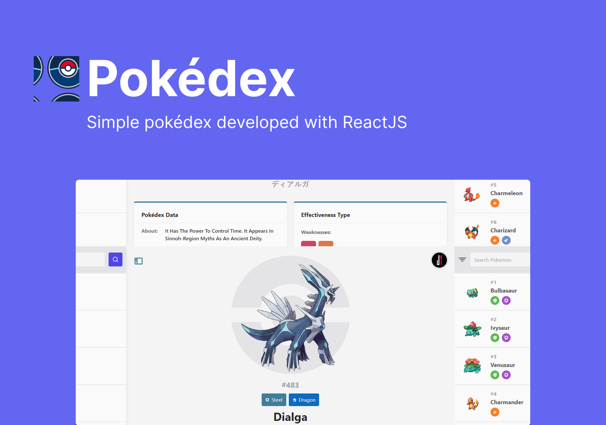

<p align="center">
  
  
</p>

<p align="center">
    
</p>

## 🧪 Technologies

This project was developed using the following technologies:

- [React](https://reactjs.org)
- [TypeScript](https://www.typescriptlang.org/)
- [Vite](https://vitejs.dev/)

## 📚 Additional libraries

- [Tailwind](https://tailwindcss.com/)
- [Phosphor](https://phosphoricons.com/)
- [Axios](https://axios-http.com/ptbr/docs/intro)
- [React Router Dom](https://reactrouter.com/en/v6.3.0/getting-started/overview)

This project was developed using the following technologies:

## 🔥 Preview

The easiest way to deploy your app is to use [Vercel Platform](https://vercel.com/new?utm_medium=default-template&filter=next.js&utm_source=create-next-app&utm_campaign=create-next-app-readme).

[](https://pokedex-jneris.vercel.app/)

## 🚀 Getting started

Clone the project and access the folder.

```bash
$ git clone https://github.com/jneris-dev/pokedex.git
$ cd pokedex
```

Follow the steps below:
```bash
# Install the dependencies
$ npm install

# Start the project
$ npm run dev
```
The app will be available for access on your browser at http://localhost:3000

## 💻 Project

To develop a web platform for listing and viewing pokemons, ReactJS was used to build this project. All data about pokémons such as name, number, type, image and among other things, were possible using the REST API [PokéApi](https://pokeapi.co/).

## 🆕 Last Updates

- Added Generation IX
- Fixed bug in filters
- Layout adjustments

## ☄ Next Updates

- [x] Filter by type
- [x] Filter by generation
- [x] Description
- [x] Resistances
- [x] Dark mode
- [x] Skeleton
- [x] Shiny versions
- [ ] Create my team
- [x] About project
- [ ] Github banner
- [ ] Profile image github
- [ ] Max-Min stats
- [ ] Evolutions conditions
- [x] Loading More Bug

## 📝 License

This project is licensed under the MIT License. See the [LICENSE](LICENSE.md) file for details.

---

<p align="center">Made with 🖤 by João Neris</p>
